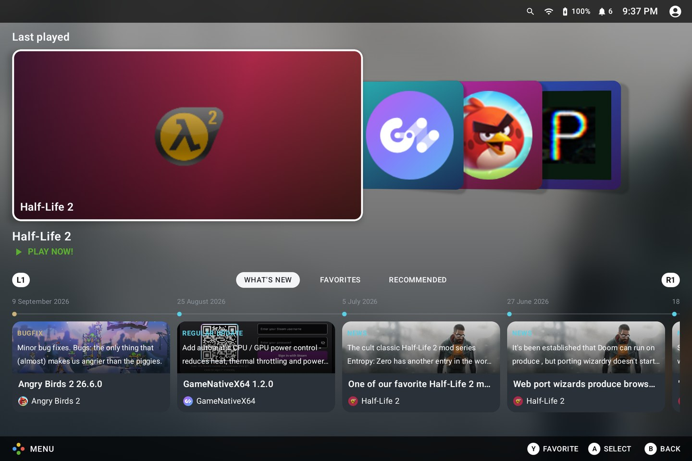
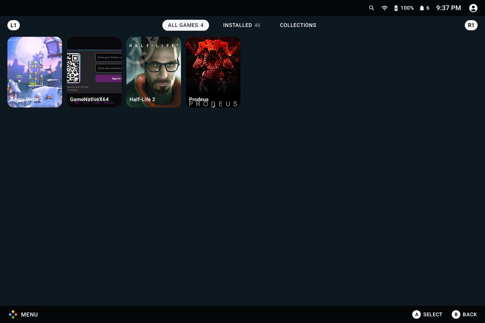
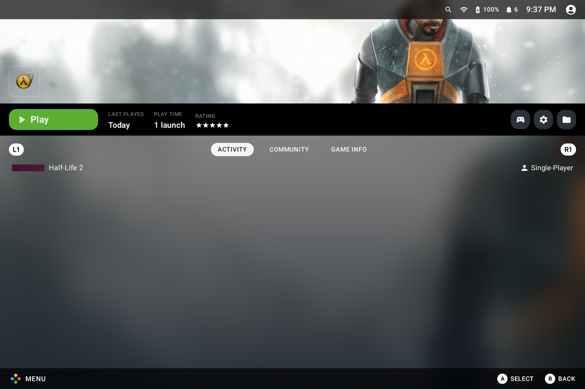
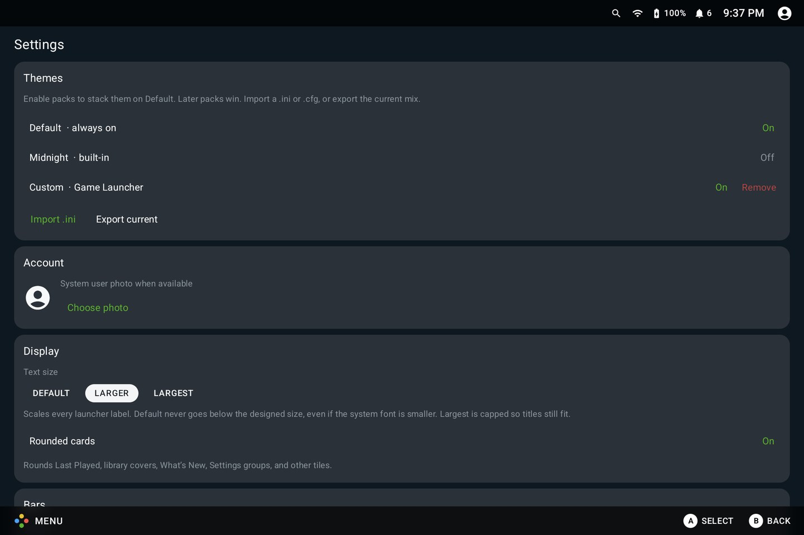

# BlissDeck

[](LICENSE)

A landscape Steam-library **HOME** for Android-x86, Bliss OS, PrimeOS, and Waydroid. It lists installed Android games and apps, launches them, and can pull covers from [SteamGridDB](https://www.steamgriddb.com/).

The display name is **BlissDeck**. The application ID is still `org.gamelauncher` (`0.1.0-dev`). Source: [Bliss-Bass/BlissDeck](https://github.com/Bliss-Bass/BlissDeck).

The layouts follow [Vapor Launcher](https://github.com/imperador/vapor-launcher). This is a new Kotlin / Jetpack Compose app, not a Qt port or a ROM frontend.

## Screenshots

|  |  |
|:----------------------------:|:----------------------------------:|
| Home | Library |
|  |  |
| Game | Settings |

## Features

- **Home**: Last Played recents (coverflow or row), selected-title backdrop, and L1/R1 feed tabs for What's New, Favorites, and Recommended
- **Library**: All Games (`CATEGORY_GAME`), Installed apps, and user collections
- **Store**: opens Play, Aurora, Droid-ify, Neo Store, or another installed store from Settings
- **Game page**: hero, Play/Stop, then Activity / Community / Game Info without tearing down the chrome
- **Settings**: themes, display (text size, rounded cards), chrome bars, borders and corner radius, recents, input, store, permissions, SteamGridDB
- Live Wi-Fi, battery, optional notification count, and an account photo in the top bar
- Package icons immediately; SteamGridDB grids, heroes, and icons when you add an API key (per-title picker on Game Info)
- Theme packs as stacked `.ini` / `.cfg` overlays (Default + Midnight built in; import/export)
- Registers as `LAUNCHER` and `HOME`, `x86_64` + ARM ABIs, minSdk 26

Desktop windowing keeps chrome below the freeform caption. Fullscreen hides the status bar and nav/dock.

Gamepad focus is still catching up (A/B/Y in the footer are mostly hints; system Back and the on-screen B control pop the stack). Friends is not built yet.

## Releases

Signed APKs ship from GitHub Releases when a `v*` tag is pushed (for example `v0.1.0`). Debug APKs are built on every push to `main`.

1. Download **`app-release.apk`** from [Releases](https://github.com/Bliss-Bass/BlissDeck/releases).
2. Install with `adb install -r app-release.apk`, then MENU -> **Set as Home app**.

[Obtainium](https://github.com/ImranR98/Obtainium) can track this repo: source GitHub, repository `Bliss-Bass/BlissDeck`, APK filter `app-release.apk`.

CI matches the other Bass Android apps ([BumpDesk](https://github.com/electrikjesus/BumpDesk), [GameNative-x64](https://github.com/Bliss-Bass/GameNative-x64)):

| Workflow | When |
|----------|------|
| **Verify Build** | push/PR to `main`: `assembleDebug` + unit tests |
| **Compile Debug APK** | push to `main`, or run manually: uploads `app-debug.apk` |
| **Compile Release APK** | manual: signed `app-release.apk` |
| **Create Release** | `v*` tag: signed release + debug APKs and notes |

Signed jobs need repository Actions secrets: `SIGNING_KEY`, `SIGNING_STORE_PASSWORD`, `SIGNING_KEY_ALIAS`, `SIGNING_KEY_PASSWORD`. Generate a keystore off-tree and upload those secrets with:

```bash
.github/scripts/create-release-keystore.sh
```

That writes `~/.blissdeck-keys/` (back that up) and calls `gh secret set` on `Bliss-Bass/BlissDeck`. See `keystore.properties.example` for a manual local signed build.

## Build

You need JDK 17+, an Android SDK (`platforms;android-35` is enough), and `ANDROID_HOME` (or `sdk.dir` in `local.properties`). Do not commit `local.properties`.

```bash
./gradlew :app:installDebug
```

Or point it at a device:

```bash
ANDROID_HOME=$HOME/Android/Sdk ANDROID_SERIAL=<serial-or-ip:5555> ./gradlew :app:installDebug
```

On a desktop-mode tablet it opens as a freeform window. Maximize or fullscreen it like any other desktop app.

### Set as Home

MENU -> **Set as Home app**, or Settings -> Permissions. Optional extras:

- **Usage access**: last-played and running titles
- **Accessibility**: close / switch freeform game windows
- **Notification listener**: badge count next to Wi-Fi and battery

## Artwork

Covers fall back to the app icon. For SteamGrid art:

1. Create a key at [steamgriddb.com/profile/preferences/api](https://www.steamgriddb.com/profile/preferences/api)
2. MENU -> Settings -> SteamGridDB -> paste the key -> Save key

The key is stored in app SharedPreferences on the device. It is not part of this repository. Games search by title and cache the grid + hero. Non-games stay on the icon unless you set an ID under Game Info -> Change ID.

## Layout

```
app/src/main/java/org/gamelauncher/
  data/          catalog, sessions, SteamGrid, Play news, themes, prefs
  ui/chrome/     top bar, MENU, search, footer, window insets
  ui/home/       recents, What's New, ambient backdrop
  ui/library/    All Games / Installed / Collections
  ui/game/       Activity / Community / Game Info
  ui/store/      preferred store launcher
  ui/settings/   prefs and theme packs
  ui/theme/      colors and blur
```

Project conventions for Cursor live in `.cursor/rules/`.

## Development

A lot of the Kotlin and Compose was written in [Cursor](https://cursor.com) with AI coding tools. People still pick the product direction, review the diffs, and test on device. The rules those tools are asked to follow are in `.cursor/rules/`. Use them or ignore them; git is what ships.

## Licensing

Much of BlissDeck is published under the GNU General Public License 3.0. See [LICENSE](LICENSE) and [LICENSES/GNU-GPL-3.0-LICENSE](LICENSES/GNU-GPL-3.0-LICENSE).

Closed-source or commercial use needs a license from Navotpala Tech (Bliss Co-Labs). See [LICENSES/LicenseRef-Bass-OS-Commercial.txt](LICENSES/LicenseRef-Bass-OS-Commercial.txt) and the [Bass licensing page](https://bliss-bass.blisscolabs.dev/licensing.html).
